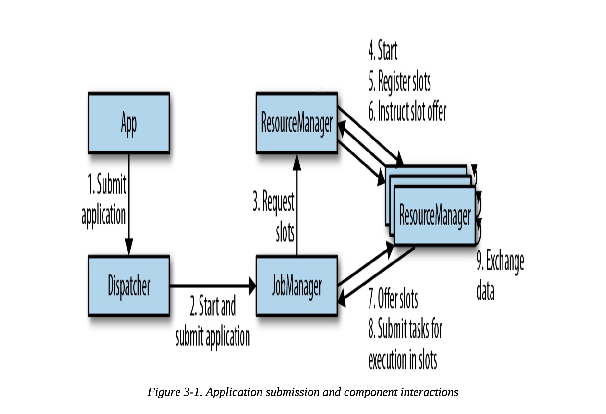
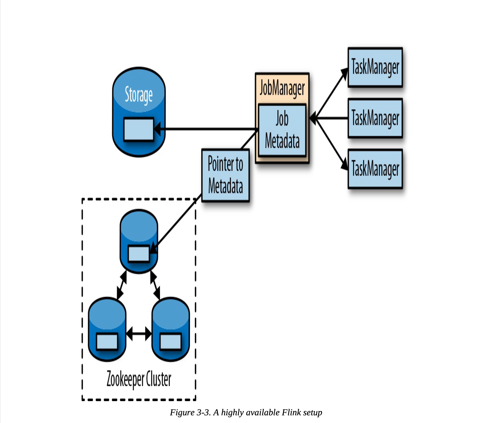

# 第三章 Apache Flink 架构
---

## Flink 组件
* JobManager
    > 主进程，控制整个应用的执行；
* ResourceManager
* TaskManager
    > Flink 的工作进程，每个TaskManager提供一定数量的处理槽；
* Dispatcher
    > 提供REST接口来让我们提交需要执行的应用；

## 应用部署
* 框架模式
* 库模式

## 任务执行
  > 一个TaskManager 允许同时执行多个任务
* **数据并行**（同属于一个算子的任务）
* **任务并行**（来自不同算子的任务）
* **作业并行**（来自不同的应用任务）

### 高可用设置
* TaskManager故障
  > TaskManager 部分故障，JobManger会向ResourceManager申请更过的TaskManger，
  > 如果没有更多空闲的TaskManager，那么JobManager将无法重启，直到有足够的处理槽；
* JobManager故障
  > 因为JobManger是主进城，它控制整个应用的执行，如果JobManager进程故障，流式应用
  > 将无法处理数据，这就成为了Flink应用的一个单点故障； 
  > 所以，Flink提供了高可用模式，支持在原JobManager消失的情况下将作业的管理职责及
  > 元数据迁移到另一个JobManager。

### Flink中的数据传输
